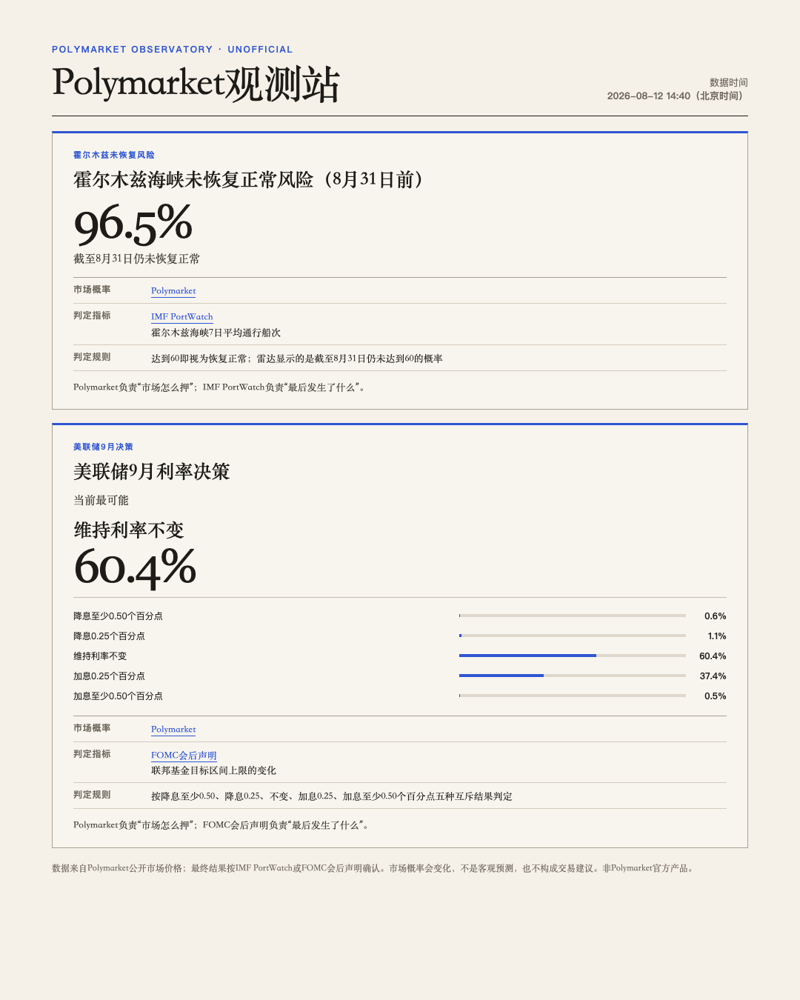

# Polymarket Observatory

A read-only event-probability radar for Chinese-speaking users. It reads public Polymarket market data, applies liquidity and spread checks, sends a Beijing-time daily digest, and issues a ServerChan / WeChat alert only when a material market change is confirmed.

> This is an independent project, not an official Polymarket product and not affiliated with Polymarket. Market prices express market expectations, not facts or investment advice. The product does not connect a wallet, request signatures, or place orders.



The user-facing report and notification copy are intentionally in Chinese. This README documents the project in English so the design and safeguards are easier to audit and reuse.

## Why this exists

Prediction-market pages are useful for active browsing, but not for ongoing, responsible monitoring. This project turns that browsing task into an auditable automation:

- Polls selected public markets every 15 minutes.
- Sends a complete daily digest at 08:00 Beijing time.
- Sends immediate alerts only for confirmed moves, threshold crossings, a change in the leading outcome, a rules change, or market closure.
- Separates what a market believes from the source that resolves the event.
- Shows a complete mutually exclusive distribution and normalizes it to 100%, avoiding the misleading shorthand of showing only a single “rate-cut probability.”
- Remains read-only: no trading, wallet, or signing capability.

The included watchlist covers two examples:

1. Whether shipping traffic through the Strait of Hormuz returns to normal before the deadline. Polymarket supplies the market probability; IMF PortWatch supplies the observed resolution metric.
2. The September 2026 Federal Reserve decision. The report displays five mutually exclusive policy outcomes; the FOMC statement is the resolution source.

## Sources and method

- [Polymarket API documentation](https://docs.polymarket.com/api-reference/introduction) — public Gamma API market discovery and reads.
- [IMF PortWatch](https://portwatch.imf.org/) — AIS-based monitoring of ports and strategic maritime passages.
- [Federal Reserve FOMC calendars](https://www.federalreserve.gov/monetarypolicy/fomccalendars.htm) — meeting dates, statements, and final policy outcomes.
- [ServerChan message format](https://sct.ftqq.com/docs/getting-started/faq/) — Markdown notifications and public-image support in WeChat.

## Design at a glance

```text
Polymarket Gamma API
        │
        ▼
Best-bid / best-ask midpoint + mutually exclusive normalization
        │
        ▼
Liquidity, spread, and probability-total quality gates
        │
        ├── Full Beijing-time 08:00 digest
        ├── Material-change alert
        └── Markdown report / HTML snapshot / 1080×1350 share card

Resolution sources: IMF PortWatch / FOMC statement
```

## Quick start

Requires Python 3.9+ and `curl`. The runtime uses only the Python standard library.

```bash
git clone https://github.com/terazadl/event-probability-radar.git
cd event-probability-radar
python3 -m venv .venv
.venv/bin/python3 Scripts/event_radar.py --dry-run
```

`--dry-run` reads live public data and prints the report, but does not write state or send notifications.

Run the test suite:

```bash
PYTHONDONTWRITEBYTECODE=1 .venv/bin/python3 -m unittest discover -s Tests -v
```

## Configure ServerChan

Use an environment variable:

```bash
export SERVERCHAN_SENDKEY="your SendKey"
```

Or copy the example file. Never commit the real secret.

```bash
cp Scripts/.secrets.example.json Scripts/.secrets.json
```

Send a full daily digest for acceptance testing:

```bash
bash Scripts/run_event_radar.sh --daily-now
```

ServerChan can render Markdown images, but the image must be available at a public URL. Set both URLs only after you have configured a publishing target:

```json
{
  "public_share_enabled": true,
  "public_share_url": "https://example.com/event-radar/",
  "public_image_url": "https://example.com/event-radar-latest.png"
}
```

When `public_share_enabled` is `true`, the daily digest publishes the current HTML snapshot and share card before sending. It sends only after the public image matches the locally generated image by SHA-256; a missing configuration, failed build, failed push, or stale CDN response blocks the digest.

## Events, alerts, and scheduling

All event definitions, market IDs, quality gates, and alert thresholds live in [`Config/event_watchlist.json`](Config/event_watchlist.json).

Default alert policy:

- A one-hour move of at least 5 percentage points.
- A 24-hour move of at least 10 percentage points.
- A confirmed crossing of 25%, 50%, or 75% (two consecutive samples).
- A confirmed change in the leading bucket of a distribution.
- A resolution-rule change or market closure.
- A six-hour per-event cooldown, unless the price moves another 5 percentage points.

Invoke the runner from any scheduler every 15 minutes. The process itself applies the Beijing-time daily-digest window and alert cooldowns.

```cron
*/15 * * * * /absolute/path/to/event-probability-radar/Scripts/run_event_radar.sh
```

## Share assets

On macOS with Google Chrome installed, export a standalone HTML snapshot and a 1080×1350 share card locally:

```bash
bash Scripts/export_event_share.sh                 # writes to exports/
bash Scripts/export_event_share.sh /tmp/radar-out  # choose an output directory
```

The command does not publish or send notifications. For the automated public-image flow, configure the environment inherited by your scheduler:

```bash
export TERA_EVENT_BLOG_DIR="/absolute/path/to/your/hexo-blog"
export TERA_EVENT_BLOG_REPO_URL="https://github.com/you/your-pages-repo.git"
export TERA_EVENT_BLOG_PAGES_BRANCH="master"
export EVENT_RADAR_NODE_BIN="/absolute/path/to/node/bin"  # optional
bash Scripts/publish_event_share.sh \
  "https://example.com/images/event-radar-latest.png" \
  "202608130800"
```

The publisher updates only `event-radar/index.html` and `images/event-radar-latest.png` on the configured Pages branch. Keep the environment variables available to the scheduled `run_event_radar.sh` process; interactive-shell exports are not inherited by `launchd` or cron automatically.

## Audit and privacy boundaries

Runtime state, history, and generated reports are written under `Data/` and `Reports/`; all are ignored by Git. Notification credentials are also ignored.

Before public use, independently verify the selected contract’s liquidity, resolution rules, local legal requirements, and the stability of each data source. This project is not trading software and must not be used as investment advice.

## Project map

- [`Scripts/event_radar.py`](Scripts/event_radar.py) — data retrieval, calculation, quality gates, alert decisions, report copy, and public snapshots.
- [`Scripts/notify.py`](Scripts/notify.py) — ServerChan delivery, graceful failure, and deduplication.
- [`Config/event_watchlist.json`](Config/event_watchlist.json) — events, quality requirements, and alert rules.
- [`Tests/test_event_radar.py`](Tests/test_event_radar.py) — probability, alert, daily-digest, image, and read-only-boundary tests.
- [`Scripts/export_event_share.sh`](Scripts/export_event_share.sh) — local HTML snapshot and share-card export.
- [`Scripts/publish_event_share.sh`](Scripts/publish_event_share.sh) — optional Pages publication and public-image verification before a digest.

## Nasdaq-100 QDII subscription radar (new)

The repository now also contains a separate, read-only monitor for RMB-denominated
Nasdaq-100 QDII funds in the direct-sales monitoring universe. It deliberately uses
the same notification module but a different data model:

```text
Official direct-sales page / notice
              │
              ▼
Status normalization (open / limited / suspended / overseas holiday / unconfirmed)
              │
              ├── Full table grouped by current status
              ├── Cross-group “今日变化” badge (no duplicate rows)
              ├── 08:00 Beijing-time summary
              └── Long share-card HTML for a complete image
```

Run a safe preview:

```bash
python3 Scripts/qdii_radar.py --daily-now --dry-run
python3 Scripts/qdii_radar.py --export-share
```

On macOS with Chrome installed, render the share card as a PNG:

```bash
bash Scripts/export_qdii_share.sh
```

To update the public Release image and send the concise ServerChan digest with
the full 41-share image attached:

```bash
bash Scripts/push_qdii_daily.sh
```

Real sends are review-gated. The scheduler refreshes the secondary discovery snapshot,
checks conflicts, and refuses to notify while any included row is still pending
manager-source verification. The publish script keeps both a stable asset and a
date-versioned image (`nasdaq100-qdii-radar-YYYYMMDD.png`), then verifies the
versioned asset hash before sending so WeChat does not reuse yesterday's image.
`--dry-run` remains available for diagnostics. A one-off manual acceptance test can
explicitly opt into pending rows with `QDII_ALLOW_REVIEW_PENDING=1`; scheduled runs
should leave this unset.

The QDII watchlist is configured in [`Config/qdii_watchlist.json`](Config/qdii_watchlist.json).
The included [`Config/qdii_universe_template.csv`](Config/qdii_universe_template.csv)
contains the current 41-code monitoring universe. The attached image covers every
RMB-denominated OTC share class in that universe and lists the displayed daily quota.
The message body stays short: total coverage, counts by current status, and today's
changes. Manager direct-platform pages and notices are preferred. When a manager page
is unavailable, an exact notice reproduced by a designated information-disclosure
publication may be used with source mode `official_notice_publication`; it must still
carry an effective date. Rows temporarily using a public fund-detail page stay in the
report with an explicit source label, so they are not presented as manager-direct data.
If a source cannot be read, the radar keeps the last configured baseline and marks
the row as stale; if wording cannot be classified, it does not overwrite the baseline.

The daily message is intentionally a summary (counts plus status changes); the attached
image/report carries the full monitoring universe. A displayed open state does
not guarantee that a particular account can place an order,
and “未披露” is not the same as “unlimited”.

Within each status section, limited-subscription rows are sorted by verified direct-sales
quota from high to low; pending-review rows are placed last. Status remains the primary
grouping, because a larger quota does not make a suspended fund investable.

The monitoring scope is intentionally `onshore_otc_rmb`: the secondary reference page
may list additional on-exchange shares and agency-only rows.  It is used for discovery
and conflict detection only, never as a direct-sales quota source:

```bash
python3 Scripts/qdii_reference.py --live
python3 Scripts/review_qdii_before_push.py --strict-reference
```

The reference snapshot is written separately to `Data/qdii/reference_latest.json`.
The review gate blocks a push when an explicitly labelled secondary direct-sales value
conflicts with the local manager source.  It does not rewrite the CSV automatically;
the fund-manager page or notice must be checked before changing a row.  On a transient
official-page failure, the radar retains the last configured value and marks that row
as a stale baseline instead of generating a false status-change alert.

Entry points:

- [`Scripts/qdii_radar.py`](Scripts/qdii_radar.py) — status model, change detection, reports, and notifications.
- [`Scripts/qdii_reference.py`](Scripts/qdii_reference.py) — secondary discovery parser for the public QDII table; never writes the main universe.
- [`Scripts/review_qdii_before_push.py`](Scripts/review_qdii_before_push.py) — structural, source, and secondary-conflict review gate.
- [`Scripts/run_qdii_radar.sh`](Scripts/run_qdii_radar.sh) — scheduler-friendly runner.
- [`Scripts/export_qdii_share.sh`](Scripts/export_qdii_share.sh) — public HTML and full long-card export.
- [`Scripts/push_qdii_daily.sh`](Scripts/push_qdii_daily.sh) — publish the full image and send the daily summary.
- [`Tests/test_qdii_radar.py`](Tests/test_qdii_radar.py) — status, grouping, change badge, and summary tests.

## License

[MIT](LICENSE)
